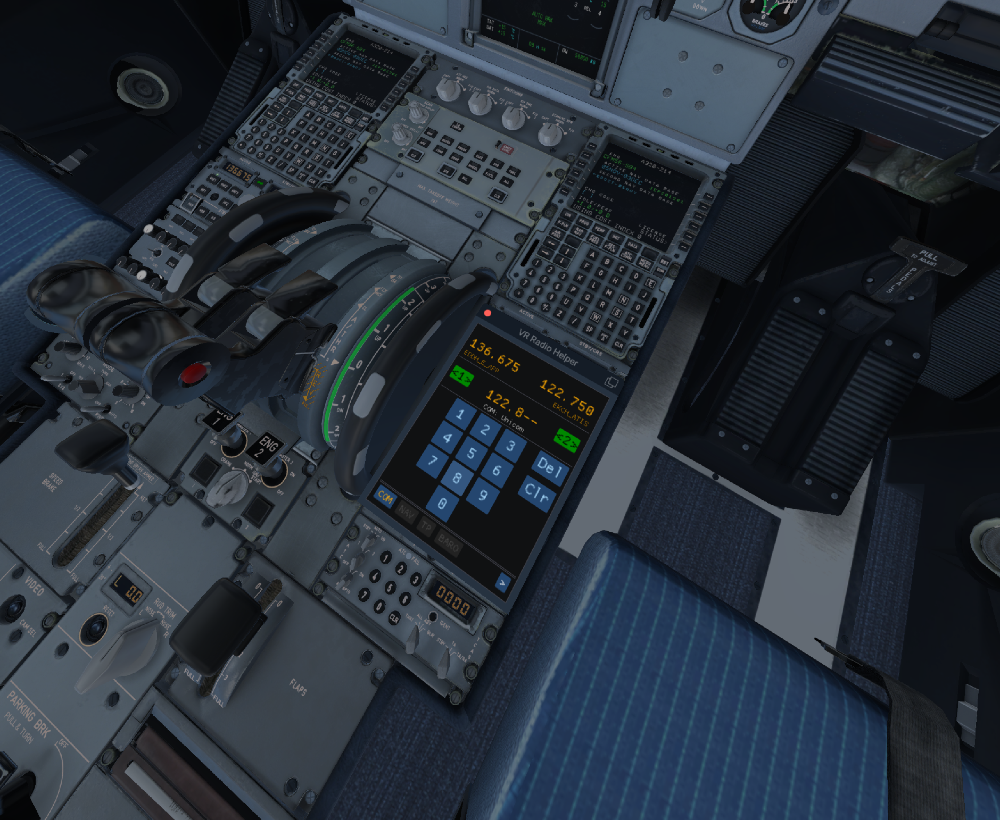

# VR Radio Helper (aka VHF Helper)
## Overview
VR Radio Helper is a FlyWithLua plugin for X-Plane 11. It allows to change the two main COM frequencies of any X-Plane airplane in **VR** via convenient touch pad number buttons in a **multicrew** environment. For many default airplanes, NAV and transponder codes can be changed as well.

Flying multicrew in X-Plane with ATC is a blast! Yet, the default X-Plane 11 VR knobs are horrible when trying to monitor/fly and dial in a new ATC frequency at the same time (takes up to 2 minutes for a 2-hour flight, just turning the knob and making sure that no turn got lost when using SmartCopilot).

VR Radio Helper:
* Makes tuning in a new ATC or NAV frequency a breeze!
* Works with SmartCopilot (both pilots need to install it) and synchronizes COM frequencies between two pilots
* Works in VR (free positioning in 3D space)
* Integrates well with ATC networks (e.g. VATSIM)




## Installation
* Install FlyWithLua: https://forums.x-plane.org/index.php?/files/file/38445-flywithlua-ng-next-generation-edition-for-x-plane-11-win-lin-mac/
* Download [latest release](https://github.com/VerticalLongboard/xplane-vhf-helper/releases/latest)
* *Use installer executable* and specify your X-Plane installation folder or unzip manually:
  * Move dependencies to `<X-Plane 11 Folder>/Resources/plugins/FlyWithLua/Modules`
  * Move `vhf_helper.lua` to `<X-Plane 11 Folder>/Resources/plugins/FlyWithLua/Scripts`

To make it multicrew-ready (do that in **BOTH** pilot's airplanes):

* Install SmartCopilot: https://sky4crew.com/smartcopilot/ and install aircraft-specific `smartcopilot.cfg`
* Add the following line to `<X-Plane 11 Folder>/ ... /<Airplane folder>/smartcopilot.cfg`, under **[TRIGGERS]**
```text
[TRIGGERS]
VHFHelper/InterchangeCOM1Frequency = 0
VHFHelper/InterchangeCOM2Frequency = 0
VHFHelper/InterchangeNAV1Frequency = 0
VHFHelper/InterchangeNAV2Frequency = 0
VHFHelper/InterchangeTransponderCode = 0
```

## Usage
* Go to `Plugins/FlyWithLua/FlyWithLua Macros/VR Radio Helper`.
* Place and scale the window wherever you like (in 2D and VR).
* Use the number buttons to enter the new VHF frequency. The last two digits are subject to auto completion.
* Press `NAV` or `XPDR` to change to NAV and transponder panels.
* Press the COM1/2, NAV1/2 or XPDR switch button to tune in new frequencies or transponder codes.
* **Chat with ATC! :-)**
* If you like, bind the toggle-panel command `FlyWithLua/VR Radio Helper/TogglePanel` to a key of your choice.

## Plane Compatibility
VR Radio Helper uses the default X-Plane way of setting COM/NAV frequencies and the transponder code. If you find that your airplane does not work out-of-the-box, please have a look at the existing [Github Issues](https://github.com/VerticalLongboard/xplane-vhf-helper/issues) and open a new one if you don't find a specific airplane.

## Dependencies
Additional dependencies besides X-Plane 11, SmartCopilot and FlyWithLua:
- LUA INI Parser
- LUA Event Bus

(All dependencies are bundled with each release)

## Developer Notes
You want to integrate VR Radio Helper into other plugins? See [VR Radio Helper Public Interface](PUBLIC-INTERFACE.md) or [Vatsimbrief Helper](https://github.com/RedXi/vatsimbrief-helper) to see it in action.

Looking for a good starting point to write your own FlyWithLua plugins? Have a look at the [A320 NORMAL CHECKLIST](https://github.com/VerticalLongboard/xplane-a320-checklist/blob/main/DEVELOPMENT_ENVIRONMENT.md)!
